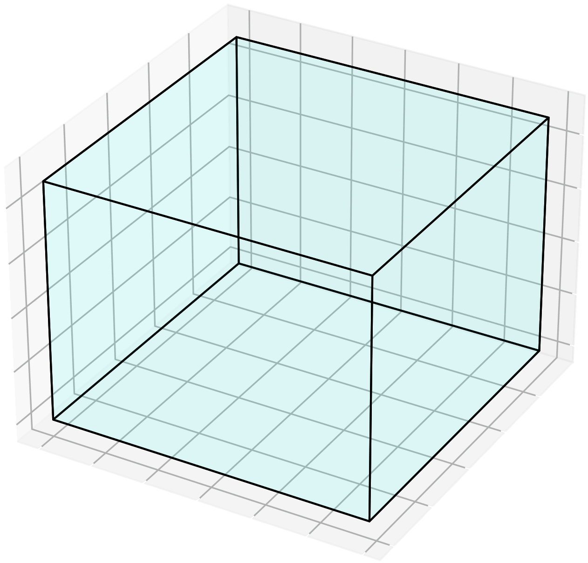
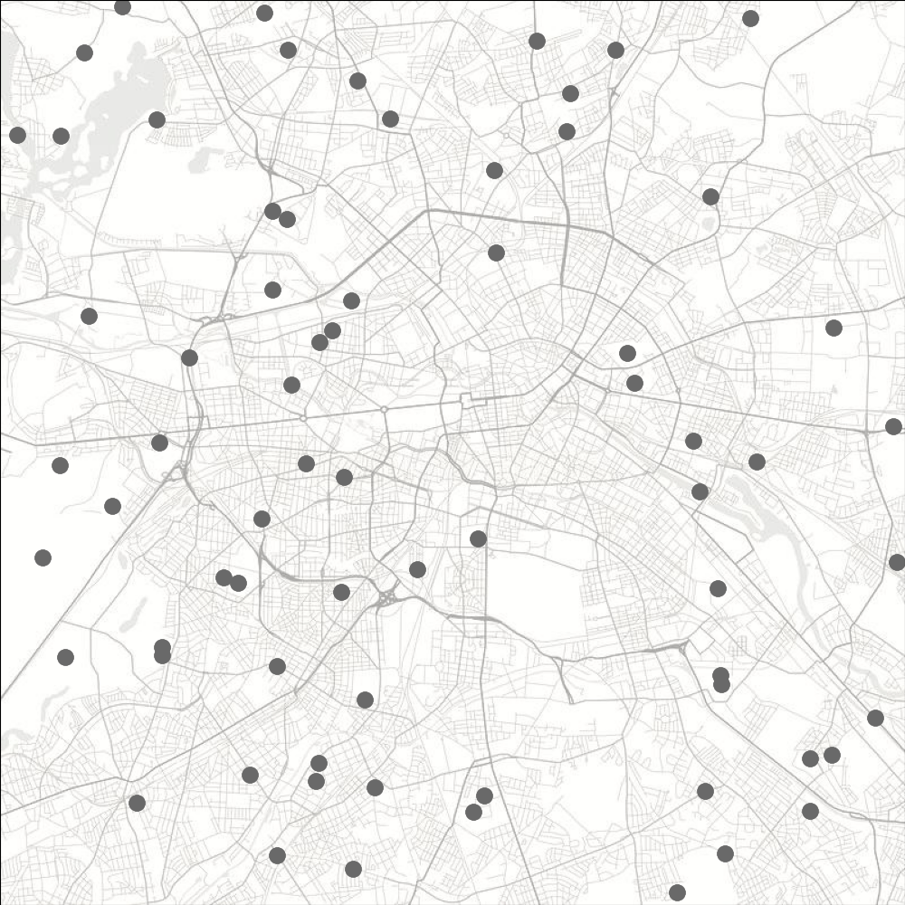
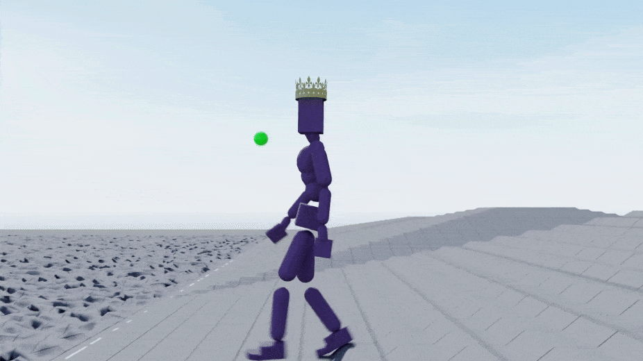
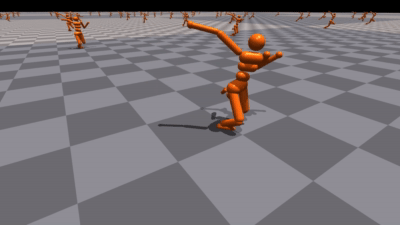
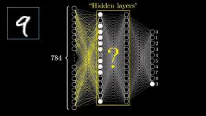
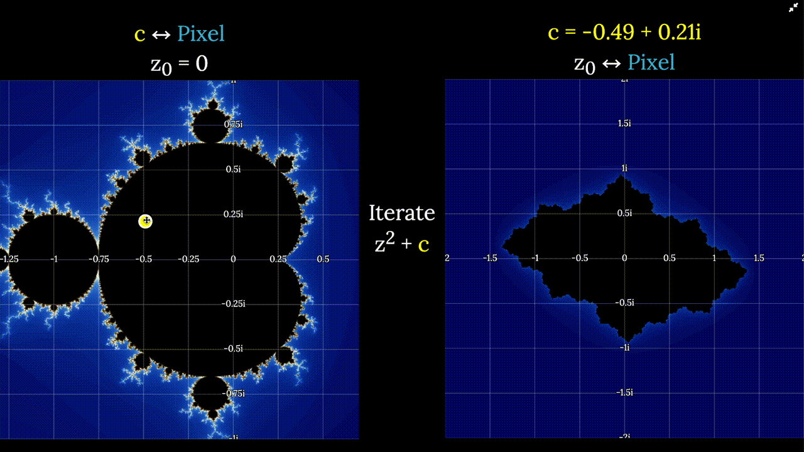
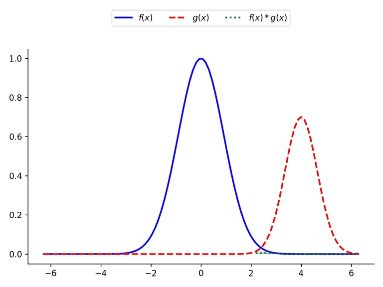
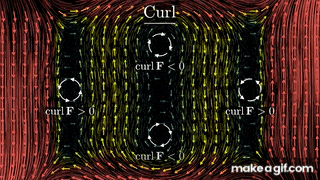
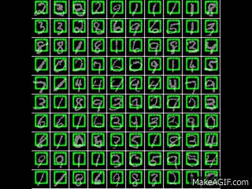

## Hi! I'm Ghassen
## I do CS x AI
### I'll skip the abstraction layer of language and tell you what I'm interested in / good at in one image

<table style="width: 85%; margin: auto; border-collapse: collapse;">
  <tr>
    <td style="padding: 0; border: none;"></td>
    <td style="padding: 0; border: none;"></td>
    <td style="padding: 0; border: none;"></td>
    <td style="padding: 0; border: none;"></td>
  </tr>
  <tr>
    <td style="padding: 0; border: none;"></td>
    <td style="padding: 0; border: none;"></td>
    <td style="padding: 0; border: none;"></td>
    <td style="padding: 0; border: none;"></td>
  </tr>
  <tr>
    <td style="padding: 0; border: none;"></td>
    <td style="padding: 0; border: none;"></td>
    <td style="padding: 0; border: none;"></td>
    <td style="padding: 0; border: none;"></td>
  </tr>
  <tr>
    <td style="padding: 0; border: none;"></td>
    <td style="padding: 0; border: none;"></td>
    <td style="padding: 0; border: none;"></td>
    <td style="padding: 0; border: none;"></td>
  </tr>
</table>
